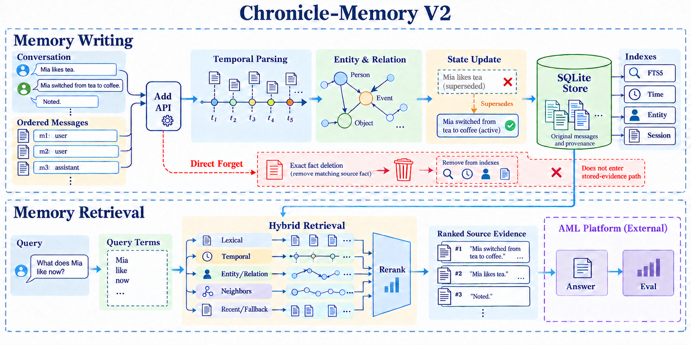

# Chronicle-Memory V2

**Source-Preserving Temporal Evidence Retrieval for Long-Term Agent Memory**

Chronicle-Memory V2 is a runnable **Textual Memory / Open-source Methods** candidate for the second Agent Memory Challenge. It implements the participant side of the current contract: synchronous Add and evidence-only Search. The competition platform performs Answer and Eval. V2 is a targeted continuation of [Chronicle-Memory V1](https://github.com/simple-boy/Chronicle-Memory), audited at commit `00d0862560aba0213ca122ef62a1bba37cf5e431`.

**Current status (2026-09-26):** the current local tree passed 40 V2 contract/scenario tests and 13 retained V1 regression tests. The service has not been Docker-built here, deployed to a public endpoint, or run through official Smoke or Full. No competition score is claimed. The official corpus, private questions, and Full orchestrator are not in the public evaluation repository. See the [Cycle 2 rules audit](docs/CYCLE2_RULES.md), [phase-by-phase project report](docs/PROJECT_REPORT.md), and [submission checklist](SUBMISSION_CHECKLIST.md).

## Overview

The system stores source messages with their original text, role, session, order, and supplied timestamp, except for narrowly recognized user instructions to forget an exact complete fact. It uses V1's SQLite FTS5, entity and relation indexes, and bounded graph expansion. V2 adds the Cycle 2 ordered `messages[]` contract, atomic idempotent writes, source-time indexing, small lexical expansions, adjacent-message recall, bounded cross-session temporal candidates, conservative explicit supersession, and query-conditioned ranking of current versus historical evidence.

Search returns ranked source evidence only. It does not write an answer into memory or generate a final response.

## Motivation

Cycle 2 evaluates long conversations, cross-session history, temporal events, multi-hop relations, personalization, governance, and streaming memory. It sends ordered messages to Add and questions to Search under the same `user_id`. A source-preserving store avoids losing details before the question is known. Time and state are useful retrieval signals, but old evidence stays available for historical questions.

This is a competition engineering upgrade, **not a claim that hierarchy, hybrid retrieval, temporal memory, or conflict tracking were invented here**. [Recent primary-source comparison and falsification plan](docs/NOVELTY_AND_EXPERIMENTS.md) identifies close prior work.

## Compared with Chronicle-Memory V1

| Area | V1 repository code | V2 implementation |
|---|---|---|
| Add input | One top-level `content` string | Official ordered `messages[]` with `role`, `content`, optional Unix-ms `timestamp` |
| Add safety | One content row per request; same text may collapse | All messages stored atomically; same request and payload are idempotent; changed retry is rejected |
| Retrieval | FTS5, BM25-style, entity/relation, two-hop, absolute date scoring | Keeps those components; adds source-time lookup, adjacent turns, bounded cross-session before/after and latest candidates, and current/history status signals |
| Relative time | No source-anchored parsing | Resolves simple expressions such as yesterday/today when the message has a timestamp; keeps raw wording |
| Changes | `from X to Y` relation within one memory | Explicit matching prior fact marked `superseded` internally; both source records remain retrievable |
| Explicit forget | No narrow complete-fact deletion in the inspected Add path | A direct user `forget`/`delete`/`remove` instruction can delete only an exactly matching complete fact and its searchable indexes; this is not general semantic forgetting |
| Single-session Top K | Diversity rule could return only five of twenty relevant records | Returns the highest-scoring records up to Top K without a per-session quota |
| Runtime | `app.py` imported missing `model_adapter.py` | Dependency-free service starts and answers local Add/Search requests |
| Submission route | README described platform-deployed Docker | Participant-hosted public Add/Search API; Docker is only a deployment aid |

The first column describes the inspected V1 **repository**, not an independently verified Cycle 1 official protocol. Full source audit: [V1_AUDIT.md](docs/V1_AUDIT.md).

## Method

### Memory Writing

1. Validate the Cycle 2 Add body and preserve the exact `request_id`, `user_id`, and `session_id` values.
2. Persist each ordered source message as a raw record unless it is the narrowly recognized exact-fact forget instruction in step 6. Store its role, source timestamp if provided, message index, and session sequence number.
3. Derive lightweight event time, entities, and relations from the raw text. Relative dates are resolved only when a source timestamp exists; ambiguous dates remain ambiguous.
4. Build SQLite FTS5, temporal, and entity/relation indexes in the same transaction.
5. For an explicit `from X to Y` statement, mark an exact subject/old-value match as `superseded`. Keep both source records for historical questions. A softer statement such as `I prefer tea now` is ranked as recent evidence without automatically declaring every older preference false.
6. For a direct **user** instruction of the form `forget`/`delete`/`remove` followed by a complete fact of at least three normalized tokens, delete only source records whose normalized **entire content** matches that fact, together with their FTS/entity/relation indexes. Do not index the instruction itself as Search evidence. This narrow behavior does not implement paraphrase matching, topic-level deletion, or general semantic forgetting.
7. Commit with SQLite WAL and `synchronous=FULL` before returning HTTP 200. A repeated request with the same payload returns success without duplicating messages.

There is **no lossy importance filter, automatic LLM summary, materialized episodic/semantic/profile layer, or vector embedding** in the default implementation. Those require measured benefit and a clear model-eligibility ruling before adding cost and complexity. `session_id` provides an episode grouping without replacing raw evidence.

### Memory Retrieval

1. Read the original question and optional multiple-choice `options`; never use a gold answer.
2. Retrieve candidates with FTS5 terms, entity index, explicit date/source-time lookup, bounded two-hop relation expansion, neighboring messages in the same session, and bounded cross-session candidates before or after a lexical event anchor. A latest/current query can also include recent candidates from the same user.
3. Rank candidates with V1's lexical, phrase, entity, relation, graph, and temporal signals plus current/historical status when the query asks for latest or prior state.
4. Sort by computed relevance and return up to the requested Top K, without a per-session quota. Prefix returned source text with its actual role, session, order, optional `source_time`, and `ingested_at` so the platform Answer model can see provenance. `ingested_at` is the ingestion time and does not substitute for an absent source timestamp; these values are text inside `content`, not extra Search JSON fields.
5. Return `{"data": [{"id": "...", "content": "..."}]}` in rank order. An empty result is `{"data": []}`.

The internal [JSON Schema](config/memory.schema.json) records the implemented fields. `MemoryStore` is SQLite; the lexical `MemoryIndex` is FTS5; the `TemporalIndex` uses `event_time_key` and `timestamp_ms`; the `EntityIndex` uses indexed entity/relation tables. There is no `VectorIndex` in this version. No public update/delete endpoint is specified by Cycle 2; internal status updates and administrative retention deletion are separate operations.

**Known limits:** source-relative days use UTC because Add has no timezone; Search has no separate question timestamp, so an unanchored “last week” is ambiguous and is not inferred from the server clock. When source time is missing, cross-session latest ranking uses ingestion order as a proxy. Exact-fact forgetting does not handle paraphrases or a request to forget a broad topic. These are open diagnostic cases, not solved benchmark capabilities.

## Architecture



The top lane shows Add, source-preserving writes, state changes, and SQLite indexes. The lower lane shows parallel lexical, entity, temporal, neighbor, and bounded fallback retrieval, followed by ranking and evidence output. The dashed AML block is external to this service. The Mia/tea/coffee text is an illustrative case for the implemented narrow supersession rule. See the [full architecture description](docs/ARCHITECTURE.md) for precise code mapping and the figure caption; [image-generation prompt and revisions](docs/IMAGEGEN_FIGURE_PROMPT.md) are recorded. An [editable technical SVG](docs/chronicle-memory-v2-framework.svg) and [PDF](docs/chronicle-memory-v2-framework.pdf) remain available for label-level editing.

## Installation

Python 3.11+ and a SQLite build with FTS5 are recommended. This implementation uses only the Python standard library; [requirements.txt](requirements.txt) has no package dependencies.

```powershell
cd Chronicle-Memory-V2
python -B -m unittest discover -s tests -v
python -B -m unittest discover -s test -v
```

The first command runs V2 contract/scenario tests; the second keeps V1 storage regressions. `-B` avoids bytecode cache files. Docker is optional for local checks:

```text
docker build -t chronicle-memory-v2:local .
docker run --rm -p 8000:8000 --env-file .env.private -v chronicle-memory-data:/app/data chronicle-memory-v2:local
```

Create `.env.private` outside source control with `MEMORY_API_KEY=<private random value>`. The named volume persists the SQLite database across container restarts. The Dockerfile copies `scripts/purge_expired.py` into the image, so a host scheduler can run it against the mounted database. Docker was **not available in the development environment**, so the image and script-in-container path have not been verified here.

## API

The `/add` and `/search` paths are this deployment's URLs; the platform lets participants configure endpoint URLs. `GET /health` needs no authentication. For Add/Search set `MEMORY_API_KEY` and use `Authorization: Bearer ...`, `Authorization: Token ...`, or `X-Api-Key: ...`.

### `POST /add`

```json
{
  "request_id": "demo-1",
  "messages": [
    {"role": "user", "timestamp": 1782432000000, "content": "Yesterday I went to the supermarket."},
    {"role": "assistant", "content": "You bought apples."}
  ],
  "user_id": "demo-user",
  "session_id": "demo-session"
}
```

HTTP 200 follows a durable, immediately searchable write:

```json
{"success": true, "request_id": "demo-1", "user_id": "demo-user", "session_id": "demo-session"}
```

The endpoint rejects non-text content arrays because this build targets the **Textual** track. It does not implement the separate image-containing Multimodal contract.

### `POST /search`

```json
{"query": "Where did I go yesterday?", "user_id": "demo-user", "top_k": 100}
```

`options` may be supplied as a top-level array of strings for choice questions. Search is scoped only by the exact `user_id`; `session_id` is not a filter. Returned item count never exceeds `top_k` (formal Top K is 100). A result contains a stable `id` and non-empty source `content`; no final answer is generated.

Validation errors use HTTP 422, invalid credentials HTTP 401, an inconsistent retry HTTP 409, and unexpected failures HTTP 500. The configurable `MAX_REQUEST_BYTES` default is 32 MiB; oversized input is rejected explicitly, never silently truncated. Official [API details](https://agentmemories.ai/api-guide) take precedence over this README.

## Running

For a local smoke test:

```powershell
$env:MEMORY_DB_PATH = Join-Path $env:TEMP 'chronicle-v2-local.sqlite3'
python -B app.py
```

In a second terminal send the JSON bodies above to `http://127.0.0.1:8000/add` and `/search`. `tests/test_api.py` starts the real HTTP server in a subprocess and checks the same contract automatically. For formal evaluation, deploy this container or service behind a stable public HTTPS endpoint, configure a persistent volume and private Memory System Key, then bind those URLs in the AML Evaluation Access Request. A local loopback URL cannot be submitted.

Operational data retention: do not log benchmark payloads. Run `python -B scripts/purge_expired.py --db <database path> --days 29 --apply` at least daily after evaluation use; it deletes entire inactive `user_id` scopes and their indexes. The script is dry-run without `--apply`. On `--apply`, it takes a write lock **before** selecting expired scopes, enables SQLite `secure_delete`, then performs `VACUUM` and WAL truncation after deletion. A busy WAL checkpoint needs a maintenance-window retry. Backups, snapshots, logs, exports, and third-party copies still require separate deletion. Verify the deployment schedule and all copies meet the official **delete within 30 days after the run** requirement.

## Evaluation

`evaluation/diagnostic.py` accepts only user-supplied public or synthetic JSONL with official Add-shaped `writes`, `queries`, and optional `gold_substrings` for evidence-level diagnostics:

```powershell
python -B evaluation/diagnostic.py --input evaluation/example.jsonl --variant full
python -B evaluation/diagnostic.py --input evaluation/example.jsonl --variant lexical
python -B evaluation/diagnostic.py --input evaluation/example.jsonl --variant v1 --v1-core ../Chronicle-Memory/memory_core.py
```

For `--variant v1`, first clone the original repository separately and check out commit `00d0862560aba0213ca122ef62a1bba37cf5e431`; the adapter passes each ordered Add chunk as one V1 content string with role/time prefixes, then searches its unmodified storage core. It does not invoke V1's missing `model_adapter.py`. The V1 adapter has **not** been run here against that pinned original core because the upstream Git endpoint was unavailable in this environment. Do not treat a run against V2's `memory_core.py` as a V1 baseline.

The script reports Recall@1/5/10, MRR, Add/Search p50/p95, memory bytes, and model call counts. These are **local evidence diagnostics, not official AML metrics**. The bundled toy file is a functionality check, not a performance benchmark. Public AML pipelines provide only partial Answer/Eval components and no complete corpus, Add/Search orchestrator, private labels, or Full score reproduction. Official scores require the platform's Smoke and Full runs.

## Ablation

The local script supports `full`, `lexical`, `minus_temporal`, `minus_entity_graph`, `minus_adjacent`, `minus_conflict`, and `minus_options`. Use identical inputs, source timestamp policy, Top K, answer model, token budget, and hardware when comparing variants. A V1 comparison should adapt the same `messages[]` input to V1's single-chunk Add while preserving all text, then report the adapter cost. A dense/vector or consolidation ablation requires implementation and rules clarification first; it is not represented as a completed component.

| Method | Official score | Recall@5 | Search p95 | Memory bytes |
|---|---:|---:|---:|---:|
| V1 adapted | null | null | null | null |
| V2 lexical | null | null | null | null |
| V2 full | null | null | null | null |
| V2 minus temporal/entity/adjacent/conflict | null | null | null | null |

Experiment design, closest prior methods, subgroup metrics, grouped bootstrap, and stopping rules: [NOVELTY_AND_EXPERIMENTS.md](docs/NOVELTY_AND_EXPERIMENTS.md).

## Competition Submission

Cycle 2 requires a participant-hosted API plus a public repository at a fixed commit, capacity/authentication notes, source attribution, a passing platform Smoke, a completed Full, and review. The application window closes **2026-10-31 23:59 UTC+8**; formal evaluation stops **2026-11-04 23:59 UTC+8**. The second Full is available only 30 days after the first finishes, so plan the first run carefully. See [SUBMISSION_CHECKLIST.md](SUBMISSION_CHECKLIST.md) and [submission.md](submission.md).

The official pages currently differ on model wording: the competition FAQ names `text-embedding-v4` and `gpt-4o-mini` for the former “academic” group; the Full gate expects `gpt-4o-mini` during Add for Open-source Methods; the documentation says the internal embedding/index model is not prescribed. This code makes **zero LLM, embedding, or external network calls**. Confirm eligibility of this deterministic configuration with the organizer before an Open-source Methods Full run; do not silently substitute another model.

## Acknowledgement

V2 builds directly on the original [Chronicle-Memory V1 repository](https://github.com/simple-boy/Chronicle-Memory) and preserves its SQLite/FTS5 and entity/time retrieval foundation. The [Agent Memory Challenge](https://agentmemories.ai/competition/) and [AML public contract](https://agentmemories.ai/rules) define the evaluation boundary. A public software license for this derivative remains to be selected by the repository owner before publication.
